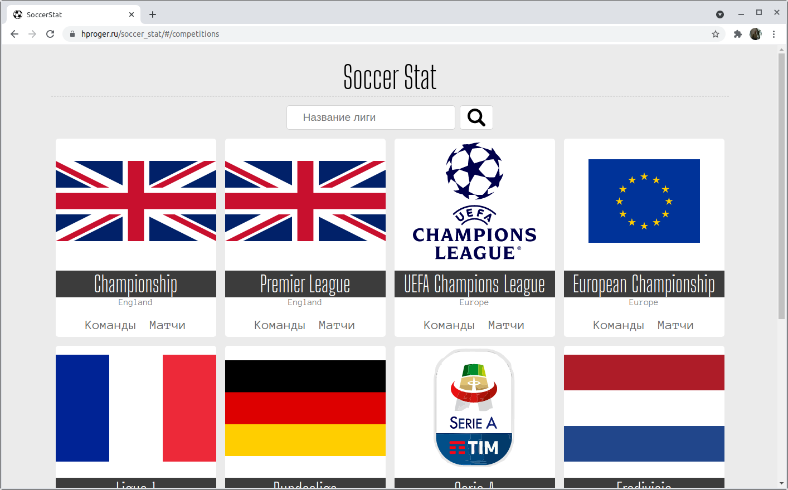
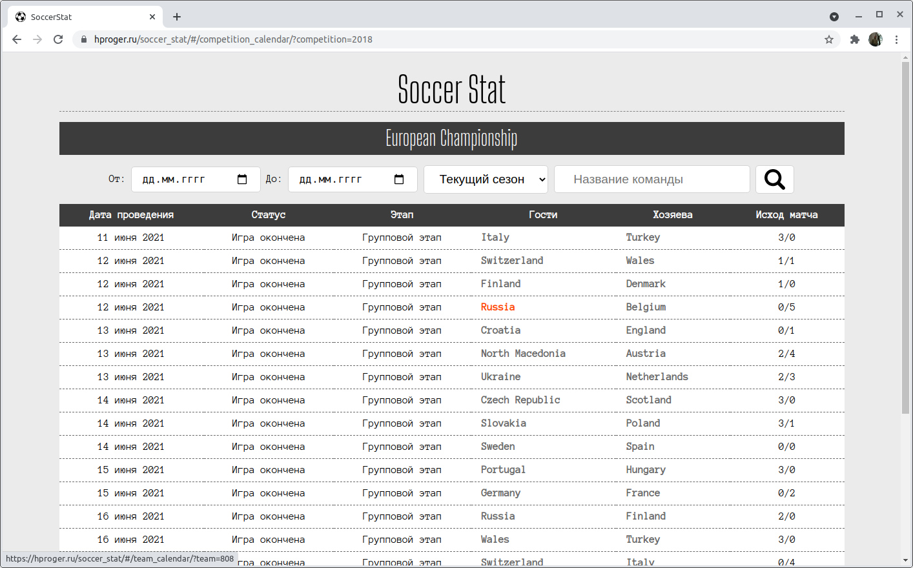
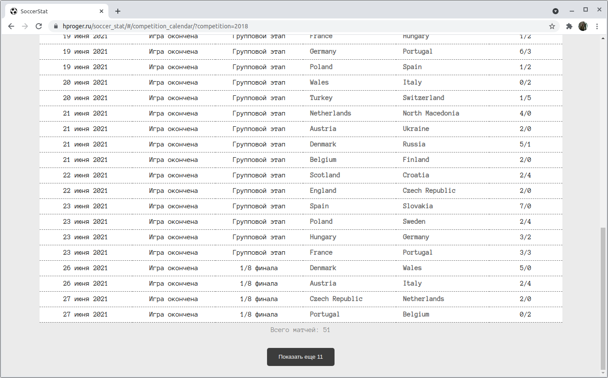
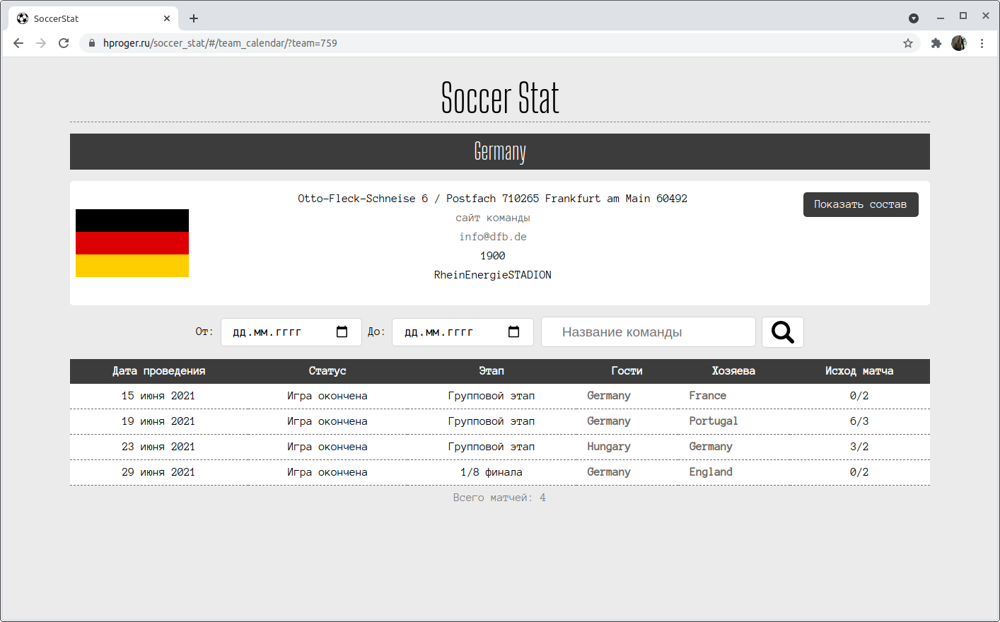
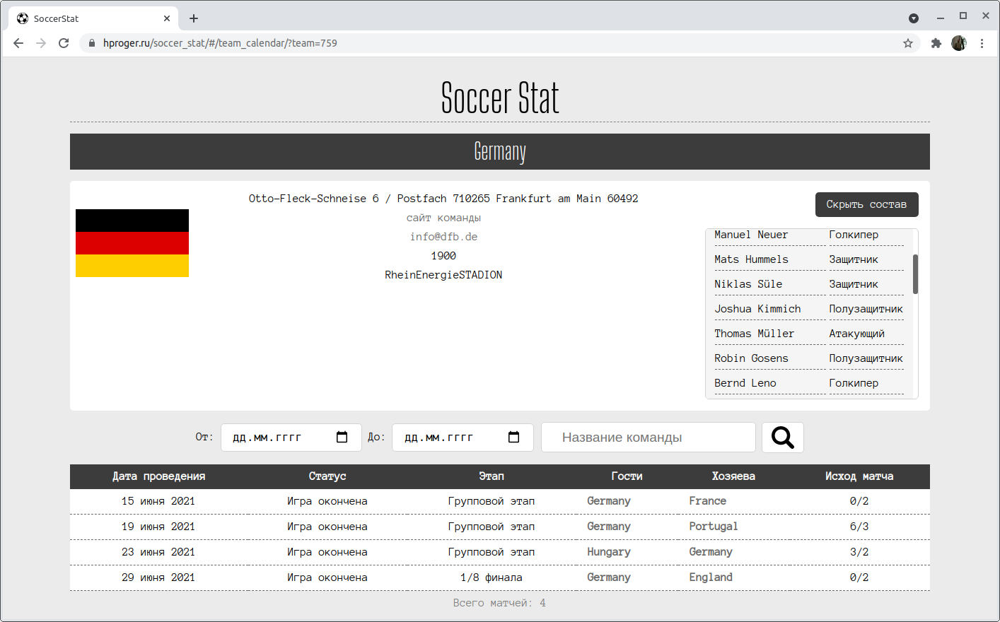
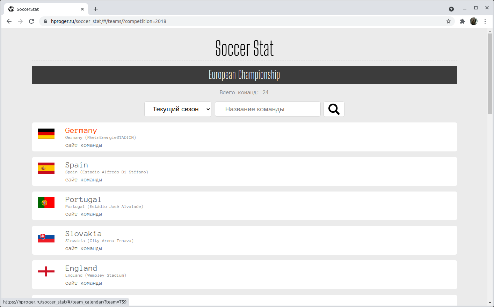

# Soccer Stat
Простой сервис для просмотра футбольной статистики. Сервис разработан за пять дней по следующему заданию:

***
### Необходимо:
Разработать приложение/web страницу для просмотра спортивной статистики.

### Требования к заданию:
Обязательные технологии: Фреймворк React/Vuejs/Angular
Допускается использовать: Любые UI библиотеки (Оценивается
рациональность выбора)

Основные требования:
Приложение должно представлять собой сайт просмотра статистики ведущих
европейских турниров по футболу.

Обязательные страницы:
- Список лиг
- Список команд
- Календарь лиги
- Календарь одной команды

На каждой странице должна быть возможность выбрать год. На страницах календаря можно указать фильтр по дате (с, по)
На страницах списка можно найти сущность по текстовому поиску. После обновления страницы данные (год, команда, поисковой
запрос) должны сохраняться, т.е. параметры должны быть отображены в адресной строке (роутинг либо GET параметры).
В качестве публичного API для получения данных рекомендуется использовать https://www.football-data.org/
***

Ниже я собираюсь немного рассказать о процессе разработки, трудностями, с которыми пришлось столкнуться и о получившемся 
в итоговом результате.

Итак, первое затруднение, с которым я столкнулся, - это полное незнание предметной области. Я - человек очень далекий от 
футбола и, чтобы понять терминологию, с которой придется работать пришлось некоторое время покопаться в интернете. Но, к
счастью, рекомендуемое в задании API хорошо документировано и это облегчило дальнейшую работу.

Для выполнения задания я, естественно, выбрал уже знакомый мне React. UI библиотеки не использовал, старался обходиться 
минимальным объемом CSS-кода, но так, чтобы разрабатываемый сервис корректно отображался и на маленьких телефонных 
экранах и на HD-мониторах. Старался использовать как можно меньше медиазапросов и только там, где нужно было адаптировать
стиль для отображения элементов на больших экранах (mobile first).

Для тестирования использовал в основном Chrome версии 91.0.4472.114. Для получения данных с внешнего сервиса использовал
fetch-api. 

Сразу же замечу, что API football-data.org хоть и хорошо документирован, но в бесплатной версии обладает очень серьезным
ограничением: не более 10 запросов в минуту. И это очень мешало даже при ручном тестировании.

Я разбил сервис (как это и было сказано в задании) на четыре раздела (или страницы).

#### Главная страница. Список лиг

Здесь пользователь видит список ведущих европейских футбольных лиг и чемпионатов. Кстати, то, что сейчас как раз 
проводится чемпионат Европы по футболу очень помогло в тестировании :)

Я добавил на страницу поле для ввода текста для отбора по наименованию лиги/соревнования. Поле для отбора по году я не
стал добавлять намеренно. Не потому, что это трудно реализовать и я не смог это сделать, а из-за ограничений, накладываемых
бесплатной версией API. Во-первых: API не предполагает отбор лиг с фильтром по сезону. Можно ли было обойти это ограничение?
Да, можно, и код для этого не потребовалось бы слишком усложнять. Надо было бы для каждой лиги выполнить отдельный
запрос для получения доступных сезонов и затем отобрать из списка лиг лишь те, сезоны которых подходят под выбранный год.
Но для этого потребовалось бы выполнить сразу 10 запросов (по числу лиг), а бесплатная версия API не дала бы этого сделать,
сразу включив троттлинг. Если выполнять запросы через определенные интервалы времени (в нашем случае, как минимум надо 
было бы выдерживать 6 секунд между запросами), то отбор лиг по году стал бы выполняться непозволительно долго! Минимум 
минута на 10 лиг! Это сделало бы сервис практически не пригодным к использованию. Поэтому-то я сознательно пошел на 
небольшое нарушение условий задания на данной странице.

Если на странице со списком лиг кликнуть по названию лиги или по флагу страны или чемпионата, то откроется список матчей.

#### Календарь матчей лиги

Я реализовал фильтры по сезону, наименованию команды и дате ("от" и "до"). Также добавил отображение списка матчей не 
всего сразу, а постранично, так что пользователь может видеть дополнительные матчи просто кликая по кнопке "Показать еще".

Замечу, что фильтр по датам ("от" и "до") реализован непосредственно на клиенте, хотя API также допускает такую фильтрацию.
Я сделал так, потому что заметил одну особенность работы API: при выборе одновременно фильтра по сезону и фильтра по дате
фильтр по сезону может игнорироваться. То есть, если пользователь выберет сезон и одновременно установит даты, не входящие 
в сезон, то будет показан список матчей, соответствующий выбранным датам! Это несколько сбивает с толку, поэтому я решил
самостоятельно реализовать фильтрацию по датам, благо это не сложно, а через API фильтровать только по сезону.

#### Календарь команды

Если кликнуть на название команды, то откроется её календарь. Также можно в отдельной области посмотреть состав команды.

#### Список команд лиги

Список команд лиги открывается при клике на ссылку "Команды" в списке лиг.

#### Организация кода
